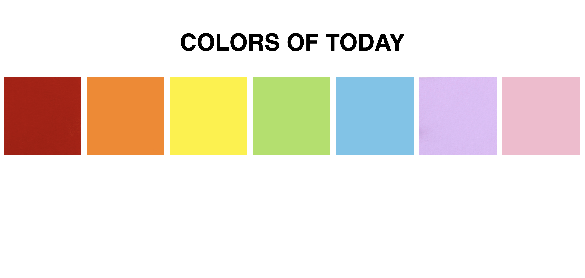
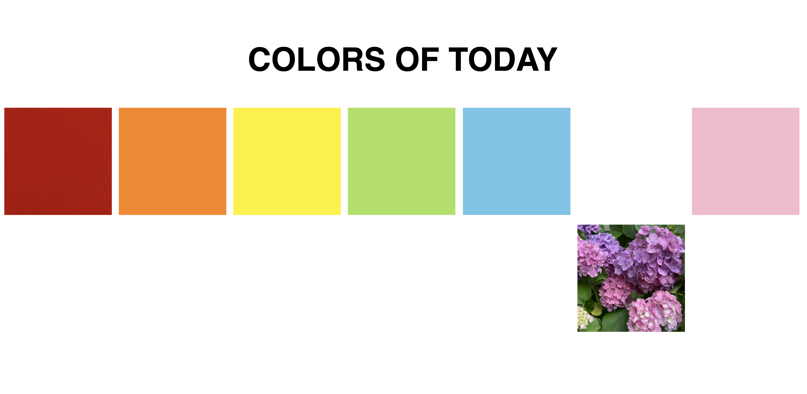

# Todays Colors
This is a simple webpage created for DSGN 234, intended to convey something about my day.
I chose to highlight the various colors that I witnessed throughout my day. This page
was also used as an exercise with the css hover feature. 

The page displays blocks of color like this:

When the user hovers their mouse over a block it drops down to reveal the image corresponding
to that color.

